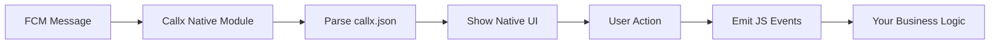

<div align="center">

# 📞 Callx

**Beautiful React Native incoming call UI with Firebase Cloud Messaging integration**

[](https://www.npmjs.com/package/@bear-block/callx)
[](https://github.com/bear-block/callx/blob/main/LICENSE)
[](https://github.com/bear-block/callx/pulls)
[](https://buymeacoffee.com/bearblock)

## ⚡ Quick Setup

**Prerequisites:** Make sure you have `@react-native-firebase/app` and `@react-native-firebase/messaging` properly set up in your project before proceeding.

### React Native CLI (Android)

1. **Install dependencies:**
   ```sh
   yarn add @bear-block/callx
   ```
2. **Add Firebase config:**
   - Download `google-services.json` from Firebase Console
   - Place in `android/app/google-services.json`
3. **Add FCM Service to AndroidManifest.xml:**
   - Open `android/app/src/main/AndroidManifest.xml`
   - Add inside `<application>`:
     ```xml
     <service
       android:name="com.callx.CallxFirebaseMessagingService"
       android:directBootAware="true"
       android:exported="false">
       <intent-filter android:priority="1">
         <action android:name="com.google.firebase.MESSAGING_EVENT" />
       </intent-filter>
     </service>
     ```
4. **(Optional) Custom FCM mapping:**
   - Create `callx.json` in your project root for custom mapping.
5. **iOS:**
   - Download `GoogleService-Info.plist` and place in `ios/YourApp/` _(iOS support coming soon)_
   - Run `cd ios && pod install` _(iOS support coming soon)_
6. **JS/TS Usage:**
   ```js
   import CallxInstance from '@bear-block/callx';
   await CallxInstance.initialize({
     onIncomingCall: (callData) => {
       /* ... */
     },
     onCallEnded: (callData) => {
       /* ... */
     },
   });
   ```

---

### Expo (Android)

1. **Install dependencies:**
   ```sh
   npx expo install @bear-block/callx
   ```
2. **Add Callx plugin to app.json:**
   ```json
   {
     "expo": {
       "plugins": ["@bear-block/callx"]
     }
   }
   ```
3. **Add Firebase config:**
   - Download `google-services.json` from Firebase Console
   - Place in `android/app/google-services.json`
4. **(Optional) Custom FCM mapping:**
   - Create `callx.json` in your project root for custom mapping.
5. **Prebuild native code:**
   ```sh
   npx expo prebuild
   ```
6. **JS/TS Usage:**
   ```js
   import CallxInstance from '@bear-block/callx';
   await CallxInstance.initialize({
     onIncomingCall: (callData) => {
       /* ... */
     },
     onCallEnded: (callData) => {
       /* ... */
     },
   });
   ```

---

## ✨ Features

<div align="center">

| 🎨 **Beautiful UI**                                  | 🔥 **Firebase Integration**             | 📱 **Lock Screen Support**               | ⚡ **Zero Config**                   |
| ---------------------------------------------------- | --------------------------------------- | ---------------------------------------- | ------------------------------------ |
| Native Android call UI with gradients and animations | Seamless FCM push notification handling | Full-screen notifications on lock screen | Works out of the box with Expo & CLI |

| 🛠️ **Multiple Modes**                     | 🔧 **Customizable**                        | 📊 **Production Ready**                  | 🚀 **High Performance**                |
| ----------------------------------------- | ------------------------------------------ | ---------------------------------------- | -------------------------------------- |
| Native, Custom, and Hybrid handling modes | Flexible FCM data mapping via `callx.json` | Comprehensive error handling & debugging | Optimized for real-time call scenarios |

</div>

---

## 🎯 How It Works

<div align="center">



**Native Mode Flow:**

1. **FCM message received** → Native code parses & shows full-screen call UI
2. **User answers/declines** → Native code emits JS events
3. **You handle business logic** → Start VoIP, log, analytics, etc.
4. **No need to build your own UI or notification logic!**

</div>

For automatic initialization, extend `CallxApplication`:

## 🔧 Configuration

### Handling Modes

| Mode                 | UI/Notification      | Who Handles UI? | Use Case          |
| -------------------- | -------------------- | --------------- | ----------------- |
| **Native** (default) | Native (recommended) | Callx           | 99% of apps       |
| **Custom**           | None                 | You             | Full custom UI    |
| **Hybrid**           | Native + custom      | Both            | Overlay, advanced |

### Custom FCM Mapping

Create `callx.json` in your project root for custom FCM data structure:

```json
{
  "triggers": {
    "incoming": {
      "field": "type",
      "value": "call.started"
    },
    "ended": {
      "field": "type",
      "value": "call.ended"
    }
  },
  "fields": {
    "callId": {
      "field": "callId",
      "fallback": "unknown-call"
    },
    "callerName": {
      "field": "callerName",
      "fallback": "Unknown Caller"
    },
    "callerPhone": {
      "field": "callerPhone",
      "fallback": "No Number"
    }
  },
  "notification": {
    "channelId": "callx_incoming_calls",
    "channelName": "Incoming Calls",
    "importance": "high",
    "sound": "default"
  }
}
```

---

## 📚 API Reference

### Core Methods

| Method                       | Description                             | Returns            |
| ---------------------------- | --------------------------------------- | ------------------ |
| `initialize(config)`         | Initialize Callx with configuration     | `Promise<void>`    |
| `handleFcmMessage(data)`     | Process FCM message and trigger call UI | `Promise<void>`    |
| `showIncomingCall(callData)` | Manually show incoming call screen      | `Promise<void>`    |
| `getFCMToken()`              | Get current FCM token for server        | `Promise<string>`  |
| `isCallActive()`             | Check if there's an active call         | `boolean`          |
| `getCurrentCall()`           | Get current call data                   | `CallData \| null` |

### Configuration

```js
await CallxInstance.initialize({
  // Handling mode
  handling: {
    mode: 'native', // 'native' | 'custom' | 'hybrid'
    enableCustomUI: false,
  },

  // Event handlers
  onIncomingCall: (callData) => {
    /* Called when incoming call detected */
  },
  onCallAnswered: (callData) => {
    /* Called when user answers */
  },
  onCallDeclined: (callData) => {
    /* Called when user declines */
  },
  onCallEnded: (callData) => {
    /* Called when call ends */
  },
  onError: (error) => {
    /* Called when error occurs */
  },

  // Debug options
  debug: {
    enabled: __DEV__,
    verbose: false,
  },
});
```

### CallData Interface

```typescript
interface CallData {
  callId: string;
  callerName: string;
  callerPhone: string;
  callerAvatar?: string;
  timestamp: number;
  metadata?: Record<string, any>;
}
```

---

## 🚀 Best Practices

### Production Setup

<details>
<summary><strong>🔐 Error Handling</strong></summary>

```js
await CallxInstance.initialize({
  onIncomingCall: (callData) => {
    try {
      startVoIPCall(callData);
    } catch (error) {
      console.error('Call handling error:', error);
      // Fallback to native UI
      CallxInstance.showIncomingCall(callData);
    }
  },
  onError: (error) => {
    console.error('Callx error:', error);
    reportError(error); // Send to your error tracking service
  },
});
```

</details>

<details>
<summary><strong>⚡ Performance Optimization</strong></summary>

```js
// Initialize once in App.js, not in components
let isInitialized = false;

const initializeCallx = async () => {
  if (isInitialized) return;

  await CallxInstance.initialize({
    // ... config
  });

  isInitialized = true;
};
```

</details>

<details>
<summary><strong>🔒 Security</strong></summary>

```js
// Validate FCM data before processing
const validateCallData = (data) => {
  const required = ['callId', 'callerName', 'callerPhone'];
  return required.every((field) => data[field]);
};

messaging().onMessage(async (remoteMessage) => {
  if (validateCallData(remoteMessage.data)) {
    await CallxInstance.handleFcmMessage(remoteMessage.data);
  }
});
```

</details>

<details>
<summary><strong>🧪 Testing</strong></summary>

```js
// Development testing
if (__DEV__) {
  CallxInstance.setDebugMode(true);
}

// Test with mock data
const mockCallData = {
  callId: 'test-call-123',
  callerName: 'Test User',
  callerPhone: '+1234567890',
  callerAvatar: 'https://example.com/avatar.jpg',
};

CallxInstance.showIncomingCall(mockCallData);
```

</details>

---

## 🧩 Examples

### Native Mode (Recommended)

```js
await CallxInstance.initialize({
  onIncomingCall: (callData) => {
    // Start your VoIP service
    startVoIPCall(callData);

    // Track analytics
    analytics.track('call_received', { callId: callData.callId });
  },
  onCallAnswered: (callData) => {
    // Handle answered call
    analytics.track('call_answered', { callId: callData.callId });
  },
  onCallEnded: (callData) => {
    // Clean up resources
    endVoIPCall(callData.callId);
  },
});
```

### Show Incoming Call

```js
await CallxInstance.initialize({
  handling: { mode: 'custom', enableCustomUI: true },
  onIncomingCall: (callData) => {
    // Show your custom UI
    showCustomCallUI(callData);
  },
  onCallEnded: (callData) => {
    // Hide your custom UI
    hideCustomCallUI();
  },
});
```

### Handle FCM Messages

```js
await CallxInstance.initialize({
  handling: { mode: 'hybrid', enableCustomUI: true },
  onIncomingCall: (callData) => {
    // Show overlay on top of native UI
    showCallOverlay(callData);
  },
  onCallEnded: (callData) => {
    // Hide overlay
    hideCallOverlay();
  },
});
```

### Get FCM Token

## 🔧 System Requirements

- **Android**: API 21+ (Android 5.0+)
- **iOS**: iOS 12.0+ (coming soon)
- **React Native**: 0.70+
- **Expo**: SDK 48+
- **Dependencies**: `@react-native-firebase/messaging`, `@react-native-firebase/app`

### Lock Screen Modes

## ❓ Troubleshooting

<details>
<summary><strong>🔧 Common Issues</strong></summary>

**FCM not working?**

- ✅ Check `google-services.json` is in `android/app/`
- ✅ Verify Firebase project settings
- ✅ Test with real device (not simulator)

**callx.json not loaded?**

- ✅ Place in project root (not in android folder)
- ✅ Verify file format is valid JSON

**Expo build fails?**

- ✅ Run `npx expo prebuild --clean`
- ✅ Check plugin configuration in `app.json`

**Custom mode UI not showing?**

- ✅ You must implement all UI logic yourself
- ✅ Check `enableCustomUI: true` in config

</details>

<details>
<summary><strong>🐛 Debug Mode</strong></summary>

```js
// Enable comprehensive debugging
CallxInstance.setDebugMode(true);

// Check current state
console.log('Active call:', CallxInstance.getCurrentCall());
console.log('FCM token:', await CallxInstance.getFCMToken());

// Test call flow
CallxInstance.showIncomingCall({
  callId: 'debug-call',
  callerName: 'Debug User',
  callerPhone: '+1234567890',
});
```

</details>

---

## 🤝 Migration Guide

### From Custom Call UI

1. **Remove custom notification logic**
2. **Replace with Callx initialization**
3. **Update FCM handling**

```js
// Before
messaging().onMessage((message) => {
  // Custom notification logic
});

// After
messaging().onMessage(async (message) => {
  await CallxInstance.handleFcmMessage(message.data);
});
```

### From Other Libraries

- **react-native-callkeep**: Callx provides better Android lock screen support
- **react-native-voip-push-notification**: Callx is more focused on UI and FCM integration
- **Custom solutions**: Callx reduces boilerplate and provides consistent UX

---

## 📖 Resources

- [🤝 Contributing](./CONTRIBUTING.md) - How to contribute
- [🐛 Issues](https://github.com/bear-block/callx/issues) - Report bugs or request features

---

<div align="center">

**Made with ❤️ by [bear-block](https://github.com/bear-block)**

[](https://github.com/bear-block/callx)
[](https://github.com/bear-block/callx)

</div>

---
