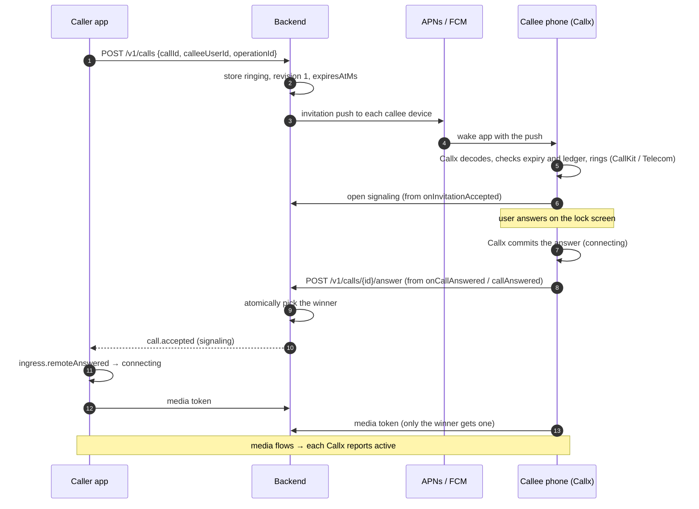
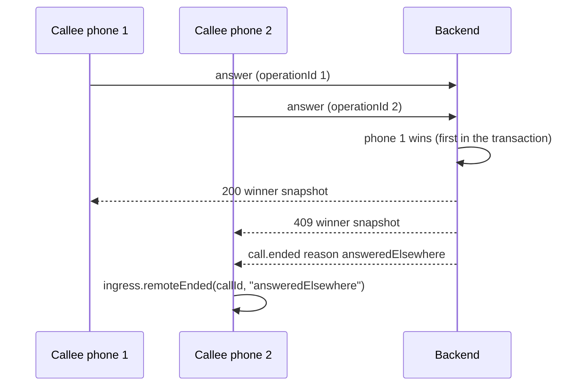
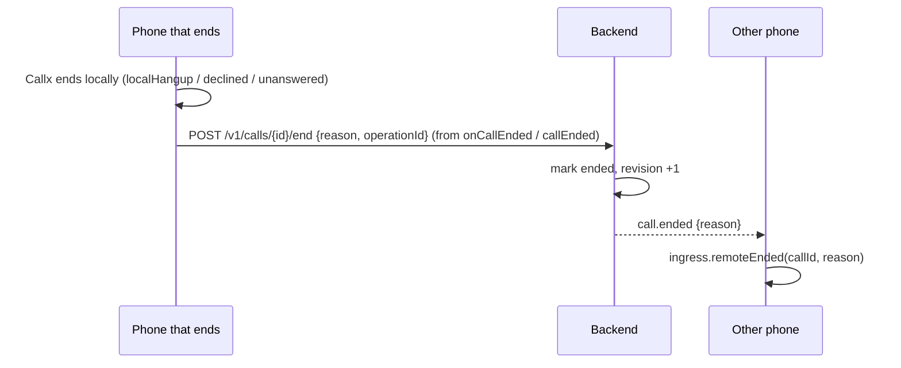

# Call flows

Each flow shows who acts and why. Endpoint names follow the
[reference design](/backend/reference); the native hooks are Callx's
(`TelecomIngressListener` on Android, `CallKitIngressListener` on iOS, and the ingress
methods). A refresher on states is in [call lifecycle](/concepts/call-lifecycle).

## Where signaling events enter Callx

Pushes reach Callx by themselves. Everything your backend says over signaling (accepted,
ended, cancelled) must be handed to the **native ingress** by your code:

| Backend event | Call on the phone |
|---|---|
| `call.invited` while the app runs (no push needed) | `ingress.handleInvitation(invitation)` |
| `call.accepted` for an outgoing call | `ingress.remoteAnswered(callId)` |
| `call.ended` | `ingress.remoteEnded(callId, reason)` with the event's reason |

Run the signaling client natively when you can. Open it in `onInvitationAccepted` /
`invitationAccepted` (the call is ringing, the process is awake even if the app was killed)
and when the user starts a call; close it when the call ends.

**Why natively:** a call can ring and be answered while no Dart or JavaScript runs (killed
app, lock screen). A "caller cancelled" event must still stop the ringing, and an "accepted"
event must still start the caller's media.

If your signaling client lives in Dart or JavaScript, hand the events over with the framework
API (from 3.0.1). They make the same ingress calls and resolve true when the call changed:

```dart
// call.accepted for your outgoing call
await CallxSignaling.remoteAnswered(event.callId);
// call.ended, with the reason from this device's point of view
await CallxSignaling.remoteEnded(event.callId, reason: EndReason.callerCancelled);
```

```ts
import {reportRemoteAnswered, reportRemoteEnded} from '@bear-block/callx';

await reportRemoteAnswered(event.callId);
await reportRemoteEnded(event.callId, 'callerCancelled');
```

They need the native bootstrap (`notConfigured` otherwise) and work while Dart or JavaScript
runs. That covers outgoing calls, since the caller has the app open. For an incoming call that
rings while the app was killed, add the [Android push signal](#caller-cancels-or-nobody-answers),
and keep the server-side expiry as the backstop on both platforms. On 3.0.0, forward these
events through a small platform channel, as the Flutter example app does.

## Incoming call, app killed



- Steps 4–5 run without your app's UI: Callx reports the call to the OS inside the push's
  time budget. **Why:** iOS kills apps that do not report a VoIP push at once, and Android
  requires the call notification within five seconds of adding the call.
- Step 8 happens on the phone before the server knows. **Why:** the OS must see the answer
  within seconds; the server decides the winner afterwards (step 10).
- With the LiveKit adapter and a token URL, the callee's token request can itself be the
  answer claim; see [media credentials](/backend/media#let-the-token-request-claim-the-answer).

`onCallAnswered` / `callAnswered` fire once per call for an answer from any surface, and also
when the remote side accepts your outgoing call; check `runtime.currentCall()?.direction`
before reporting an answer. They run under the ingress lock: start the request and return.

## Another device answered first



Phone 2 shows the call as answered elsewhere and stops its media. Send the `call.ended`
event even though the 409 already told the loser: devices that rang but did not try to answer
need it too. **Why:** a user with a phone and a tablet must not have the second one keep
ringing after they picked up.

## Outgoing call

1. The app makes a new UUID `callId` and calls `POST /v1/calls` (idempotent by
   `operationId`).
2. On success it calls `callx.startCall({callId, displayName, handle, video})`. If that is
   rejected (busy, no permission), it calls `POST /v1/calls/{id}/end` with reason `failed`.
3. The native host opens signaling for the call.
4. On `call.accepted`, the host calls `ingress.remoteAnswered(callId)`; Callx moves to
   `connecting`, the media adapter starts, and Callx reports `active` once media flows.
5. On `call.ended` (declined, unanswered, busy), the host calls `ingress.remoteEnded` with
   that reason.

**Why the backend first:** if the phone showed an outgoing call before the server accepted it,
a server failure would leave the user staring at a call nobody receives. Creating first, with
the same `callId` on both sides, means a retry after a timeout finds the same call.

## Hang up, decline, no answer



In `onCallEnded` / `callEnded`, read `runtime.currentCall()?.endReason` and report only the
ends this phone decided: `localHangup`, `declined` and `unanswered`. Ends that came from the
backend (`remoteEnded`, `callerCancelled`, `answeredElsewhere`) need no report.
**Why:** reporting a remote end back to the server creates an echo; the idempotent end
endpoint absorbs it, but it wastes a round trip and can confuse the end reason.

Map reasons from the ending side's point of view: the callee's `declined` becomes `declined`
for the caller; the caller hanging up before an answer becomes `callerCancelled` for the
callee.

## Caller cancels, or nobody answers

- **Cancel:** the backend marks the call ended (`callerCancelled`) and sends `call.ended` to
  every callee device. A device calls `ingress.remoteEnded(callId, "callerCancelled")`, even
  if its invitation has not arrived yet. Callx records the ID, so the late push does not ring.
- **Server timeout:** run a timer at `expiresAtMs`. If still ringing, mark it ended
  `unanswered` and tell both sides. **Why:** the backend is the only place that knows the
  call was never answered on any device; phones can be offline, killed or out of battery.
- **Phone timeout:** Callx also ends a ringing call at its own ring deadline (45 seconds by
  default, capped by `expiresAtMs`). Keep `expiresAtMs` at or below that so both agree.

On Android, the callee gets a missed-call notification with **Call back** automatically
([phone features](/guide/phone-features#requests-from-outside-the-app)). Record missed calls
in your own history; send your own missed-call push only if you turned Callx's off.

A callee device that is not connected to signaling (no socket yet) still stops ringing at
expiry. On Android (from 3.0.1) you can also stop it at once: send `call.ended` as a
**normal-priority** FCM data message under the same `callx` key, and Callx ends the call
itself, with no app code running:

```json
{"message": {"token": "ANDROID_FCM_TOKEN", "android": {"priority": "NORMAL", "ttl": "30s"},
  "data": {"callx": "{\"schemaVersion\":1,\"type\":\"call.ended\",\"callId\":\"85a4fd88-…\",\"reason\":\"callerCancelled\"}"}}}
```

`call.accepted` works the same way. Use normal priority: these messages show nothing, and FCM
deprioritizes apps whose high-priority messages do not. Callx 3.0.0 and older ignore these
payloads without ringing, so sending them to mixed app versions is safe. iOS has no
equivalent, because every VoIP push must ring.

## Call back from Recents or a missed call

Since 3.0.0, tapping a call in iOS Recents, a contact card, Siri or Android's missed-call
**Call back** gives your app a call request (`Callx.callRequests` /
`addCallRequestListener`) carrying the `handle` you sent in the invitation. Your app looks it
up and runs the outgoing flow above.

**Why it matters for the backend:** the `handle` must stay resolvable to a person, for weeks.
Use a stable application address such as `callx:user-a`, not a session ID or anything secret:
the OS stores it in its call history.

## Rename the caller during a call

If your backend learns a better name after the invitation (a CRM lookup, a queue transfer),
send it over signaling and call `callx.setDisplayName(callId, name)` from your app. iOS updates
CallKit and Recents; Android updates the notification.

## Reconnecting

When the signaling connection comes back, resume from your last cursor
(`GET /v1/call-events?cursor=…`). If the server answers with a gap, fetch
`GET /v1/calls/{id}` for the current call and apply its state (for example `remoteEnded` if it
ended meanwhile). **Why:** events sent while the phone was offline are otherwise lost, and a
call would stay "live" on one side forever.
