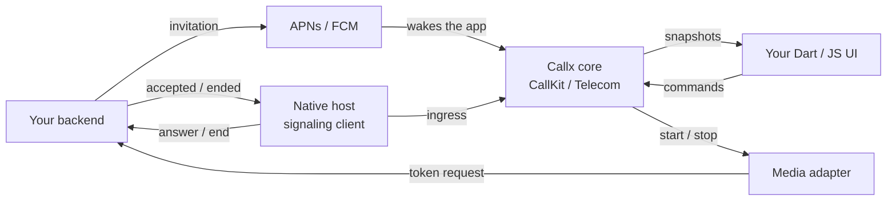

# Your backend and Callx

Callx is the phone side of a call. It has no server: your backend decides who is called, who
answered and when a call is over. This section explains how to build that backend so it fits
the way Callx works, and why each rule exists.

Read the pages in order the first time:

1. **This page**: who owns what, and the rules that follow from it.
2. [Call flows](/backend/call-flows): every call, step by step, with what the phone and the
   backend each do.
3. [API and push payloads](/backend/reference): the endpoints, data model and the exact push
   payloads Callx decodes.
4. [Media credentials](/backend/media): tokens for LiveKit or your own media.
5. [Production checklist](/backend/production): push credentials, monitoring and retention.

## Who owns what

| Concern | Owner | Why it lives there |
|---|---|---|
| Who is calling whom, call expiry | Backend | Only the backend sees every participant and device |
| Which device answered first | Backend | Several devices of one user can answer at the same moment; only one place can decide |
| Whether a call has ended for everyone | Backend | A hangup on one phone must reach the other phone even if it is offline |
| Ringing, the system call screen, the lock screen | Callx, on each phone | The OS gives the app a few seconds and no UI engine; Callx reports the call natively before Dart or JavaScript runs |
| This phone's call state (answered here, muted, held, media connected) | Callx, on each phone | Only the phone knows what the user tapped and whether audio flows |
| Media (rooms, tracks, tokens) | Your media provider, with tokens from your backend | Media needs credentials that only the backend may issue |

Two owners, never one shared state: the backend is the truth **between** devices, and the
Callx core is the truth **on** a device. A device never writes call state to the backend
("set state = active"); it sends intents (*answer*, *end*), and the backend answers with facts
(*you won*, *answered elsewhere*, *ended*). The device then records those facts in Callx.

## The rules, and why

### 1. Send invitations as pushes, and only invitations

Send a new call to each of the callee's devices as an APNs VoIP push (iOS) or a high-priority
FCM data message (Android). Send everything else (accepted, ended, cancelled) over your
signaling connection.

**Why:** a push is the only way to wake an app that is not running, and the OS grants that
wake-up only for calls. iOS requires every VoIP push to be reported to CallKit at once and
stops delivering VoIP pushes to apps that do not; FCM lowers the priority of apps whose
high-priority messages do not show something to the user. A "call cancelled" VoIP push would
have to ring a fake call to satisfy iOS.

### 2. Give every invitation an expiry, and set FCM's TTL to the time left

Put `expiresAtMs` in the invitation; set the FCM `ttl` to the seconds remaining until then and
`apns-expiration: 0` on APNs.

**Why:** a call is only worth ringing while the caller still waits. Callx refuses an
invitation that arrives after `expiresAtMs` and ends a ringing call when it passes. The FCM
TTL lets Google hold the message through a short network gap (Doze, a reboot, a network
switch) and still deliver it in time. A TTL of `0s` drops it whenever the phone is not
connected at that instant, and the call never rings.

### 3. Never reuse a `callId`

Use a fresh UUID per call, and keep ended calls on the server for at least the invitation
lifetime plus your retry window.

**Why:** Callx keeps a ledger of ended calls (24 hours) and will not ring an ID it has seen
end, so a delayed or duplicated push cannot resurrect a cancelled call. A reused ID would be
refused as already ended. The server keeps its own record so a late `answer` or a retried
`create` gets the real outcome instead of starting something new.

### 4. Pick one answer winner atomically

When an `answer` request arrives, accept it only if the call is still ringing and unexpired,
in one transaction. Every later answer gets the winner's snapshot, and the other devices get
`call.ended` with reason `answeredElsewhere`.

**Why:** Callx commits an answer on the phone immediately, because CallKit and Telecom give
it only a few seconds and the user may answer from the lock screen before your app starts. It
cannot wait for the server. So two devices can both believe they answered; the backend
decides, and the loser ends gracefully with the right reason in its UI and call history.

### 5. Make every write idempotent

Key create, answer and end by (account, `operationId`, request fingerprint). A retry returns
the first outcome; the same ID with a different body is a conflict.

**Why:** phones retry. A request can time out after the server committed it, the process can
die mid-request, a network can change during an answer. Callx itself gives each command an
`operationId` for the same reason. Without idempotency a retry creates a second call or ends
the next one.

### 6. Number every event and deliver it at least once

Give each event a unique `eventId` and each call a `revision` that increases with every
change. Commit the change and its outgoing event in one transaction (an outbox), and let a
worker deliver it with retries.

**Why:** pushes and sockets duplicate, reorder and drop messages. Devices drop an event whose
`eventId` they have seen or whose `revision` is older than the one they hold, so redelivery
is safe and nothing is lost when a worker crashes after the commit.

### 7. Issue media credentials per participant, after authorization, never in a push

The phone asks for a token when the call is answered (the LiveKit adapter does this natively).
Check that the user is a participant (and, for the callee, the answer winner) before issuing
a short-lived token.

**Why:** a push payload passes through Apple, Google and device logs, and goes to every
device, including the ones that will lose the answer. A token in the push would let any of
them join. Fetching natively means media starts even when the call was answered from the lock
screen with no Dart or JavaScript running.

### 8. "Accepted" on the server is not "connected"

Record `accepted` when the answer wins. Record media quality and call duration from the media
provider or from the phones, not from the accept.

**Why:** Callx reports `active` only when the media adapter confirms audio flows. Between
accept and media, a call can still fail (permissions, network, credentials). Billing or
analytics based on accept count calls that never connected.

### 9. Bind push tokens to the signed-in user

Store tokens per app installation and user; remove or rebind them on sign-out and when a push
provider reports them invalid.

**Why:** an invitation goes to whoever's token you hold. A token left from the previous user
rings the wrong person, and invalid tokens waste the push budget. On the phone, Callx isolates
each sign-in with `accountGeneration` for the same reason.

## What Callx does not do for you

- It does not open a connection to your server. Your native host (or app) runs the signaling
  client; see [call flows](/backend/call-flows#where-signaling-events-enter-callx).
- It does not send pushes or hold APNs or Firebase credentials. Those stay on your server.
- It does not decide answers across devices or end calls on the other phone.
- It does not relay or record media.

If your media provider already owns invitations and pushes (for example Twilio Programmable
Voice), use [provider-managed signaling](/guides/provider-managed) instead of this design;
never run two backends that both send invitations.
