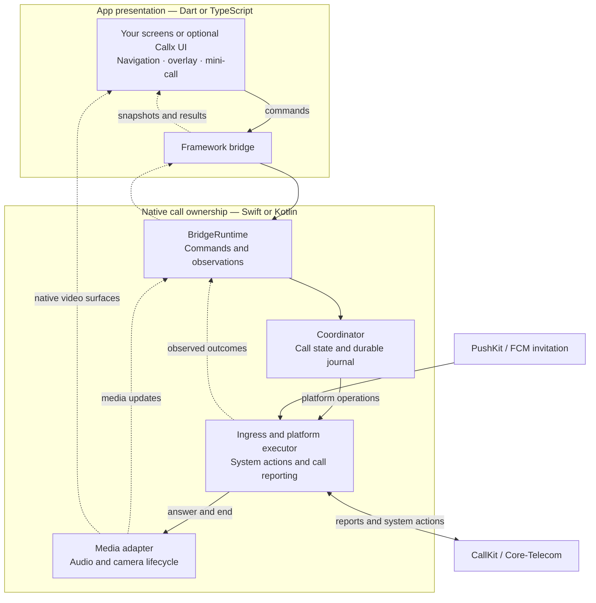
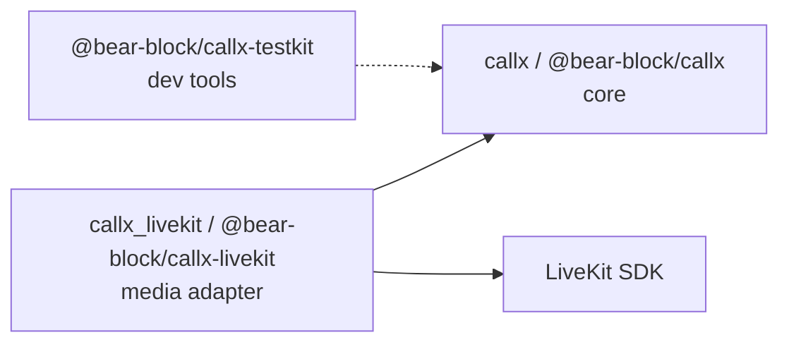
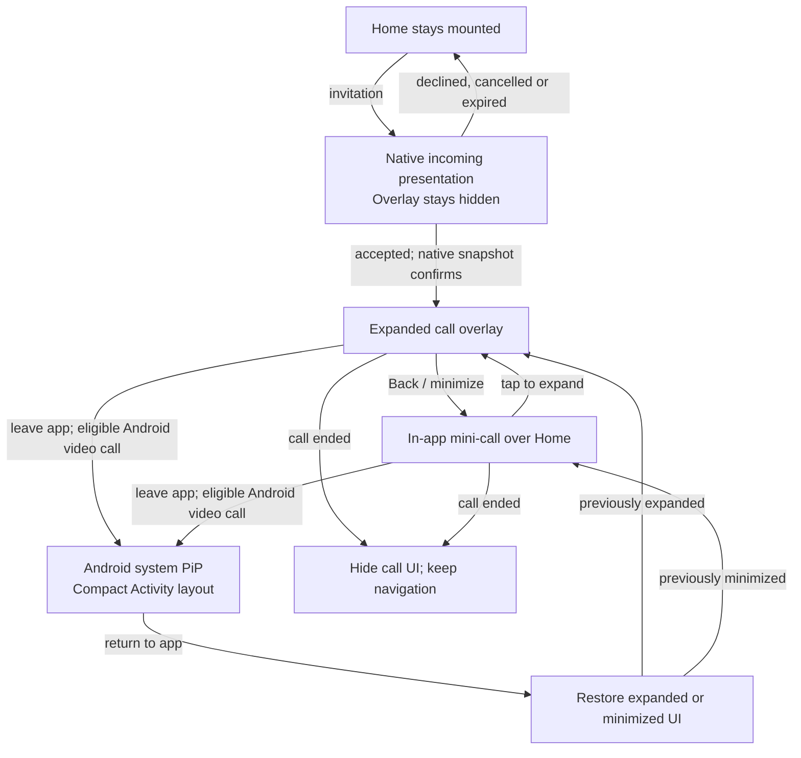

# Architecture

Callx is one native core per platform, Swift on iOS and Kotlin on Android, with thin bridges to
Dart and TypeScript. Both framework packages ship the same native sources, so a call behaves the
same way in a Flutter app and in a React Native app.

The diagram separates app presentation from native call ownership. Solid arrows carry
commands or actions; dotted arrows carry observed results and lifecycle updates.

Only the coordinator writes durable call state. UI presentation has its own transient
hidden/expanded/minimized state; it never becomes a second call-state owner.

## Components

| Component | Owns | Does not do |
|---|---|---|
| **Dart / TypeScript API** | Commands, results, snapshots, observation sessions | Background execution, audio, state decisions |
| **BridgeRuntime** | The single entry point for both bridges; capabilities; event delivery | Network or media |
| **Coordinator** | The call state, operation results, the durable journal, ended-call tombstones | Talking to the OS directly |
| **Ingress** | Receiving pushes, deciding whether a call may ring, reporting it to the OS, ring deadlines, the Android notification | Choosing an answer winner across devices (your backend does) |
| **Platform executor** | Turning commands into CallKit transactions or Telecom actions, and waiting for them to complete | Media |
| **Media adapter** | Joining and leaving media, reporting when it flows | Reporting calls to the OS |
| **Your native host** | Starting the bootstrap, forwarding FCM, backend calls from the listener | Call state |
| **Your backend** | Creating calls, sending pushes, arbitrating answers, ending calls for everyone | Phone-side presentation |

## Rules the architecture enforces

**One platform owner.** Only the ingress reports calls to CallKit or Core-Telecom. Adapters
translate provider events into Callx calls. Two components reporting the same call is the most
common cause of duplicate or ghost calls.

**Native first, framework second.** Everything the OS waits on (reporting a push, answering from
the lock screen, a hang-up from a watch) completes natively. Dart and JavaScript observe the
result. A Flutter hot restart or a JavaScript reload never loses or repeats a call action.

**Commands complete on evidence.** A command is `applied` when the platform reports the action
done, not when the request was submitted. An accepted CallKit transaction is not the same as a
fulfilled action.

**State has one writer.** Only the coordinator changes call state, and it saves to disk before
reporting success. If the write fails, the previous state is restored and the command fails.

## One bootstrap

`CallxBootstrap` assembles all of this in one call at process start:

1. Load the coordinator's checkpoint for the current account generation.
2. Create the platform owner (`CXProvider` or Telecom `CallsManager`), the ingress and the
   executor.
3. Discover an installed media adapter.
4. Recover from the previous process (see [recovery](/concepts/recovery)).
5. Install the runtime for your framework and, on iOS, start PushKit.

Every option has a default. Hosts with special needs can build the pipeline themselves from the
same parts; see [native host integration](/guides/native-host).

## Packages and their boundaries

- The core depends on nothing but the platform: no Firebase, no media SDK.
- An adapter depends on the core and one provider SDK, pinned.
- Adapters find the core through a versioned interface (`apiVersion` 1 for audio; 2 for video) and are discovered
  from their manifest (Android) or `Info.plist` (iOS). More than one media adapter is refused
  at bootstrap rather than guessed.
- All packages release together with the same version number.

## Scope of this version

One live call at a time on iOS and Android, with native video, picture-in-picture and optional
framework UI. Web runs only the simulator. See
[status](/project/status) for verification and the [roadmap](/project/roadmap) for remaining work.

## Optional app presentation

`callx_ui.dart` and `@bear-block/callx/ui` are opt-in UI entry points. Their controller tracks
only hidden/expanded/minimized presentation from observed native call snapshots. It does not
ring, answer, end, join media or add a call state. The root overlay preserves app navigation;
the mini-call stays inside the app, and system PiP remains Activity window state. Commands
are explicit app callbacks. Media rendering remains with existing video surfaces/adapters.
See [call overlay and mini-call](/guide/call-ui).

## From Home to a compact call

This is the current example flow, with native incoming presentation and framework UI after
acceptance. A custom foreground incoming screen requires coordinating with the native presenter.

Mini-call is app UI; system PiP is an OS window. On Android the whole activity shrinks, and
automatic PiP requires Android 12+ and a live eligible video call; the app supplies compact
video or branding and handles a call ending while the PiP window remains open. On iOS
(experimental) the core shows the call's video in AVKit's video-call PiP window.
Secure PIN lock-screen video acceptance has passed for Flutter/RN on Android API 36. Other
Android versions, iOS and physical devices remain unverified; see [status](/project/status).
