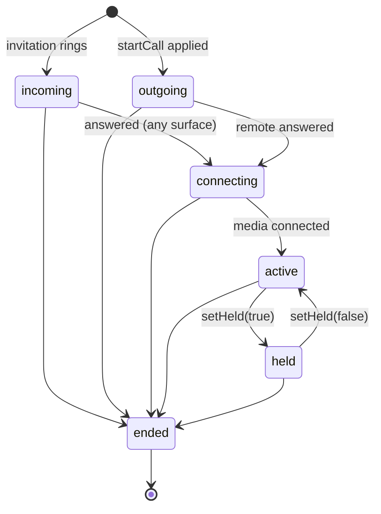

# Call lifecycle

A Callx call is always in one of six states. The native coordinator is the only thing that
changes the state, and every change is saved before your app hears about it.



| State | Meaning | `mediaReady` |
|---|---|---|
| `incoming` | The phone is ringing with the system incoming-call UI | `false` |
| `outgoing` | You started a call; the other side has not answered | `false` |
| `connecting` | Answered, locally or remotely; media is not flowing yet | `false` |
| `active` | Media is confirmed to flow | `true` |
| `held` | The call was active and is on hold | stays `true` |
| `ended` | Over. No further commands apply | `false` |

## Answered is not connected

Answering moves a call to `connecting`, never directly to `active`. A call becomes `active`
only when the media engine reports that the other party's audio actually arrives
(`mediaConnected`, which the LiveKit adapter reports for you). This lets your UI show
"Connecting…" honestly instead of a live call with silence.

## Media interruptions

`mediaInterrupted` is a flag, not a state. It becomes `true` when media that had connected
drops, for example while the media SDK reconnects after a network change, and returns to
`false` when media flows again. It can only be `true` while the call is `active` or `held`.

It never ends, holds or otherwise changes the call. If media does not come back, your backend
decides to end the call through signaling. Hold is not an interruption.

## The call object

```ts
interface Call {
  callId: string;
  displayName: string;
  direction: 'incoming' | 'outgoing';
  state: 'incoming' | 'outgoing' | 'connecting' | 'active' | 'held' | 'ended';
  muted: boolean;
  mediaReady: boolean;
  mediaInterrupted?: boolean;
  endReason?: EndReason;
  createdAtMs?: number;
  acceptedAtMs?: number;      // when it was answered
  mediaConnectedAtMs?: number; // first time media flowed
  endedAtMs?: number;
}
```

Timestamps are Unix milliseconds. Unknown timestamps are absent, never `0`. Use
`acceptedAtMs` for a call timer; Android's ongoing-call notification does the same.

## End reasons

| `endReason` | Meaning |
|---|---|
| `localHangup` | This device hung up |
| `declined` | This device declined the incoming call |
| `remoteEnded` | The other party hung up an established call |
| `callerCancelled` | The caller gave up before anyone answered |
| `unanswered` | Nobody answered before the ring deadline |
| `busy` | The callee was busy |
| `failed` | The call could not be set up or recovered |
| `answeredElsewhere` | Another device of the same user answered |
| `declinedElsewhere` | Another device of the same user declined |

Your host passes one of these when it reports a remote end; any other value is rejected.

## Rules that keep calls from coming back

- A `callId` is never reused. The core keeps a ledger of ended calls (24 hours, 1,000 calls),
  so a late or duplicate invitation for an ended call never rings.
- A remote end for a call that has not rung yet is recorded too, so a cancel that overtakes its
  invitation still wins.
- An unanswered call ends at its ring deadline: 45 seconds, or the invitation's `expiresAtMs`
  if earlier.
- Ended calls disappear from snapshots after five minutes. Keep your own call history if you
  need one.

## One call at a time

This version supports one live call. An invitation that arrives during a call does not ring and
is reported to your listener as busy, so your backend can tell the caller. A `startCall` during
a call returns `busy`.
