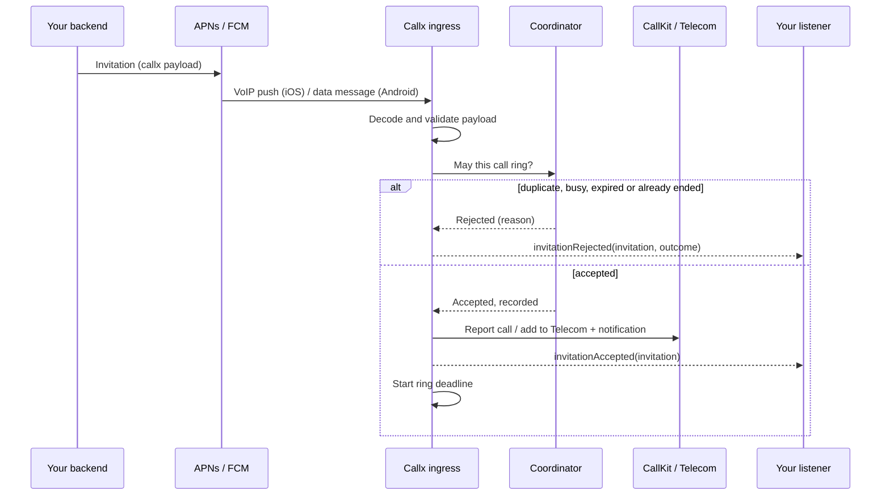

# Incoming calls and push

Callx owns the incoming path. Your backend sends one push; the native ingress receives it,
decides whether the call may ring, reports it to the OS and shows the incoming UI, all before
Dart or JavaScript runs.

## From push to ringing

The ingress checks, in order:

| Check | Outcome when it fails |
|---|---|
| The payload decodes as a Callx invitation | Not a Callx message (Android: `handlePush` returns `false`) or rejected as undecodable |
| The call has not already ended | `Ended`: never rings, even if the cancel arrived first |
| The same call is not already live | `Duplicate`: the live call is untouched |
| No other call is live | `Busy` |
| `expiresAtMs` has not passed | `Expired` |

## iOS: PushKit and CallKit

- The ingress owns the app's `PKPushRegistry` and records the VoIP token.
- iOS requires every VoIP push to be reported to CallKit before the push handler returns. The
  ingress reports natively and completes the push without waiting for Dart, JavaScript or the
  network, so the app is never terminated for a late report.
- When a push must be reported but may not ring (duplicate, busy, expired, already ended,
  undecodable), the ingress reports it under a fresh UUID and ends it at once, so it can never
  end the real call.
- On iOS 26.4 and later, the ingress skips that report when the push metadata says reporting is
  not required.
- If CallKit refuses a report (for example Do Not Disturb), the call is recorded as ended
  `failed`, so no phantom call remains.

## Android: FCM and Core-Telecom

- Your app's Firebase messaging service forwards each message to `ingress.handlePush`. Callx
  declares no messaging service and does not depend on Firebase. The Expo plugin generates the
  service for you.
- `handlePush` returns only after the call rings or is rejected (at most eight seconds), inside
  FCM's processing window.
- The call is added to Telecom and its CallStyle notification posted within Core-Telecom's
  five-second limit.
- The incoming notification repeats the ringtone until it is answered, declined, silenced or
  removed, on a dedicated channel with ringtone audio attributes.
- When the device is locked or the screen is off, Callx's native incoming-call screen appears
  full screen at once. It is plain Android views, so it does not wait for Flutter or React Native
  to start. While the phone is in use, the call appears as a heads-up notification.
- Your listener gets `onPushReceived` with the delivered and original FCM priority, so you can
  log deprioritized invitations.

## What the OS decides

No library can override these platform rules. Callx behaves as well as the platform allows and
documents the rest:

| Situation | Android | iOS |
|---|---|---|
| App in use, unlocked | Heads-up notification | CallKit banner or full screen (user setting) |
| Locked or screen off | Full-screen incoming-call screen | CallKit full-screen UI |
| App swiped away | FCM restarts the process on most devices | PushKit relaunches the app |
| Answered while locked | Configurable: unlock first, or show over the lock screen | Call connects; the app opens after unlock |
| Force-stopped in Settings | No FCM until the user opens the app | Not applicable |
| OEM battery manager blocks autostart | FCM may not arrive; only the user can change it | Not applicable |
| After reboot, before first unlock | Missed (not direct-boot aware) | Missed (storage is locked until first unlock) |
| Full-screen intents denied (Android 14+) | Heads-up notification instead | Not applicable |

The [Android](/platforms/android) and [iOS](/platforms/ios) pages explain each case and how to
help users fix the ones they control.

## Invitations over signaling

When your app is running and already connected to your signaling server, an invitation can
arrive there instead of by push. Pass it to `ingress.handleInvitation(invitation)`; it goes
through exactly the same checks. A call that arrives by both paths rings once.

## Cancelling a call

Cancellation is a signaling event, not another push. When the caller gives up, your backend
tells the callee's devices over signaling, and the host calls
`ingress.remoteEnded(callId, "callerCancelled")`. If the cancel reaches a device before the
invitation does, the call is recorded as ended and the invitation never rings.
