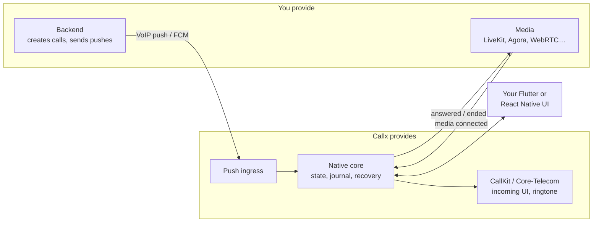

# Get started

Callx turns a push from your backend into a real phone call: the system incoming-call UI on
iOS and Android, answer and decline from anywhere, and a call state your app can trust. This
page explains the pieces; the next pages install them.

## The pieces of a call

| You provide | Callx provides |
|---|---|
| A backend that creates calls and sends an APNs VoIP push or an FCM data message | Receiving that push natively, deciding whether it may ring, reporting it to the OS |
| A media engine, or the [LiveKit adapter](/guide/livekit) | Starting and stopping media at the right moment, from any surface |
| Your call screens | A snapshot of the call, typed commands, replay after a crash or reload |
| APNs and Firebase credentials, on your server | The incoming-call screen and notification on Android, CallKit on iOS |

## Requirements

| | Minimum |
|---|---|
| iOS | 15.0, Xcode 26 or later, Swift 6 |
| Android | API 29 (Android 10), compile SDK 36 |
| Flutter | Flutter 3.41, Dart 3.11 |
| React Native | 0.76 (New Architecture or legacy), React 18 |
| Expo | SDK 57 with a development build (not Expo Go) |

Real calls need a physical device for push delivery. The iOS Simulator cannot receive VoIP
pushes and ends CallKit calls immediately; the Android emulator works for most flows.

## Choose your path

  

    <h4>Flutter</h4>
    
Add <code>callx</code>, call <code>CallxPlugin.bootstrap</code> from your Application and AppDelegate.

    
<a href="./flutter">Flutter quick start →</a>

  

  

    <h4>React Native CLI</h4>
    
Add <code>@bear-block/callx</code>, bootstrap from MainApplication and AppDelegate.

    
<a href="./react-native">React Native quick start →</a>

  

  

    <h4>Expo</h4>
    
Add the config plugin. No native code at all, including the FCM service.

    
<a href="./expo">Expo quick start →</a>

  

Then add audio: install the [LiveKit adapter](/guide/livekit), or
[connect your own media](/guides/own-media). Want to look around first?
[Run the simulator](/guide/simulator), which needs no backend, no device and no credentials.

## A complete first call, step by step

1. **Install and bootstrap** Callx for your framework (the quick starts above).
2. **Register the push token**: `callx.getPushToken()` (JavaScript) or `Callx.pushToken()`
   (Dart) returns `{type: 'voip' | 'fcm', token}`. Send it to your backend.
3. **Send an invitation** from your backend: an APNs VoIP push or an FCM data message with a
   `callx` payload. [Payload reference →](/guides/backend#ios-apns-voip-invitation)
4. **The phone rings natively**, even if the app was killed.
5. **Answer**. Callx tells your host to start media (the adapter does it for you), and your UI
   sees the call move from `incoming` to `connecting`.
6. **Media connects**. The call becomes `active`.
7. **Hang up** from either side. Both phones clean up, and a late push for the same call can
   never ring again.
