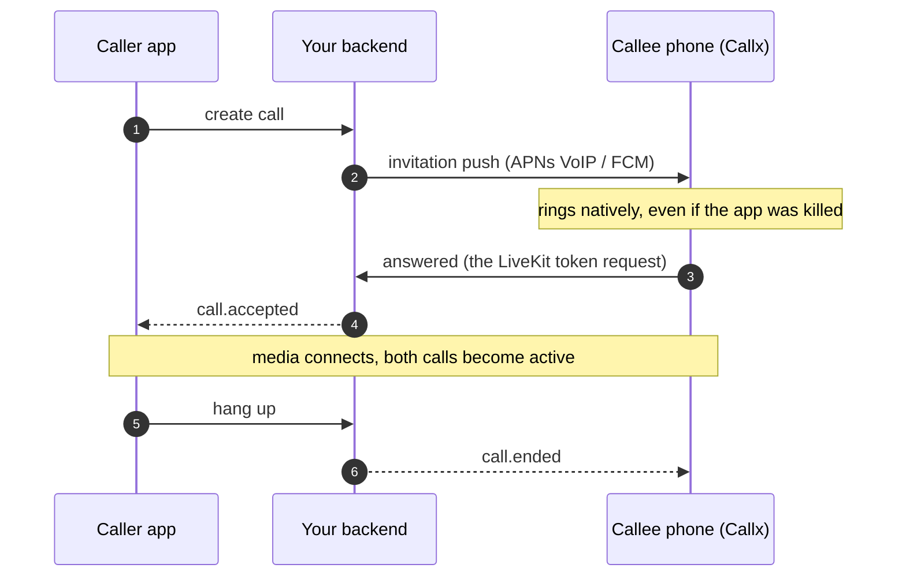

# Get started

Callx turns a push from your backend into a real phone call: the system incoming-call screen on
iOS and Android, answer and decline from anywhere (lock screen, notification, watch, car), and a
call state your app can trust. This page is the whole integration in five steps. Each step links
to the detail page only when you need it.

## How a call works

Three parts take part in every call. Callx is only the middle one.

| Part | Who builds it | What it does |
|---|---|---|
| **Your backend** | You | Decides who calls whom, sends the invitation push, tells each phone when the call was accepted or ended |
| **Callx**, on each phone | Installed package | Receives the push natively, rings with CallKit or Telecom, records answer and hang-up from any surface, gives your UI one call state |
| **Media** | The LiveKit adapter, or your own engine | Carries the audio and video once the call is answered |



Your UI never drives the call directly. It sends commands (`answer`, `end`, `setMuted`) and
renders the snapshot Callx publishes: `incoming → connecting → active → ended`.

## 1. Install and bootstrap

Callx has to start with the app process, before Dart or JavaScript exists, so that a push can
ring a killed app. That is a few lines of native code, or none with Expo. Follow the page for
your framework, then come back here.

<div class="start-paths">

<a href="/callx/guide/flutter"><strong>Flutter</strong><span><code>callx</code> · Application, FCM service, AppDelegate →</span></a>
<a href="/callx/guide/react-native"><strong>React Native CLI</strong><span><code>@bear-block/callx</code> · MainApplication, FCM service, AppDelegate →</span></a>
<a href="/callx/guide/expo"><strong>Expo</strong><span>Config plugin, no native code →</span></a>

</div>

**Done when** the app builds and runs on a device with the Callx native module linked.

## 2. Start Callx and register the push token

Create one `Callx` instance for the app, call `setup()`, and send the push token to your
backend so it can invite this device.

::: code-group

```ts [React Native / Expo]
import {Callx} from '@bear-block/callx';

export const callx = new Callx();

const capabilities = await callx.setup();
if (capabilities.nativeCalling) {
  const token = await callx.getPushToken(); // {type: 'voip' | 'fcm', token}
  if (token) await api.registerPushToken(token.type, token.token);
}
```

```dart [Flutter]
import 'package:callx/callx.dart';

final callx = Callx();

final capabilities = await callx.setup();
if (capabilities.nativeCalling) {
  final token = await callx.pushToken(); // PushToken(type: 'voip' | 'fcm', token: ...)
  if (token != null) await api.registerPushToken(token.type, token.token);
}
```

:::

`nativeCalling` is `false` when the bootstrap failed or the device has no Telecom; hide your
call buttons then. Ask for the microphone permission (and notifications on Android 13+) while
the app is open: the prompt cannot appear over the lock screen.

**Done when** your backend stores a token per installation: `voip` on iOS, `fcm` on Android.

## 3. Make it ring

Your backend sends an **invitation** to each of the callee's devices: an APNs VoIP push on
iOS, a high-priority FCM data message on Android. The payload is a small JSON object under the
`callx` key:

```json
{
  "schemaVersion": 1,
  "type": "call.invited",
  "callId": "85a4fd88-b5c3-4f79-a2cf-a7db9df06750",
  "displayName": "Alex",
  "handle": "callx:user-a",
  "expiresAtMs": 1790000030000
}
```

Before your backend exists, send the same push from your machine with the testkit:

<!--@include: ./parts/test-push.md-->

**Done when** you kill the app, send the push, and the phone shows the system incoming-call
screen with "Alex". Answer moves your snapshot to `connecting`; it stays there until media
connects in step 4. Not ringing? See [troubleshooting](/guides/troubleshooting#the-phone-does-not-ring).

Full APNs and FCM request formats: [API and push payloads](/backend/reference#ios-apns-voip-invitation).

## 4. Add audio and video

Install the LiveKit adapter. Callx finds it by itself and joins the call's LiveKit room natively
when the call is answered, even from the lock screen with no Dart or JavaScript running.

<!--@include: ./parts/livekit-install.md-->

Tell the adapter where to fetch a room token, after sign-in:

<!--@include: ./parts/livekit-configure.md-->

When a call is answered, the adapter posts `{"callId": "…"}` to that URL; your backend answers
`{"url": "wss://…", "token": "…"}` with a LiveKit token for the room `call-<callId>`. The
[LiveKit page](/guide/livekit) has the Android JitPack and iOS `Info.plist` lines, and a
ten-line Node.js token handler. Using another media SDK? [Bring your own media](/guides/own-media).

**Done when** both phones hear each other and the snapshot reaches `active`.

## 5. Connect your backend both ways

Callx handles everything on the phone. Three things still travel between your app and your
backend:

| Direction | When | Code |
|---|---|---|
| App → backend → Callx | The user calls someone | Create the call on your backend, then `callx.startCall(...)` |
| Backend → Callx | The other side accepted or hung up | `reportRemoteAnswered(callId)` / `reportRemoteEnded(callId, reason)` |
| Callx → backend | This phone hung up, declined or timed out | Watch for `ended` with a local `endReason` and tell the backend |

The callee's answer needs no extra code with LiveKit: your token endpoint treats the token
request as the answer and sends `call.accepted` to the caller
([why](/backend/media#let-the-token-request-claim-the-answer)).

### A complete call service

This is the file most apps end up with. It is all the Callx code an app needs besides its
screens. `./backend` is your client for your server; the
[example backend](/backend/example) has one, and runs this file end to end.

::: code-group

```ts [React Native / Expo]
// calls.ts
import {Callx, reportRemoteAnswered, reportRemoteEnded, type Call} from '@bear-block/callx';
import {configureLiveKit} from '@bear-block/callx-livekit';
import {api, liveKitConfig, newUuid, signaling, startSignaling} from './backend'; // your client

export const callx = new Callx();

// Ends this phone decided. Ends that came from the backend need no report.
const LOCAL_ENDS = new Set(['localHangup', 'declined', 'unanswered']);

/** Call after sign-in. */
export async function startCalls(render: (call: Call | null) => void) {
  const {nativeCalling} = await callx.setup();
  if (!nativeCalling) return;

  const token = await callx.getPushToken();
  if (token) await api.registerPushToken(token.type, token.token);

  // {tokenUrl, headers}: the session and the installation ID, so the request can claim the answer
  await configureLiveKit(liveKitConfig());

  // Backend → Callx
  signaling.on('call.accepted', (event) => reportRemoteAnswered(event.callId));
  signaling.on('call.ended', (event) => reportRemoteEnded(event.callId, event.reason));
  void startSignaling();

  // Callx → your UI, and this phone's hang-ups → backend
  let reported: string | undefined;
  return callx.observe(({call}) => {
    render(call);
    if (call?.state === 'ended' && LOCAL_ENDS.has(call.endReason ?? '') && reported !== call.callId) {
      reported = call.callId;
      void api.endCall(call.callId, call.endReason);
    }
  });
}

export async function callUser(user: {id: string; name: string}, video = false) {
  const callId = newUuid();
  await api.createCall({callId, calleeUserId: user.id, video}); // the backend pushes the invitation
  const result = await callx.startCall({callId, displayName: user.name, handle: `callx:${user.id}`, video});
  if (result.status !== 'applied') await api.endCall(callId, 'failed');
}
```

```dart [Flutter]
// calls.dart
import 'dart:async';

import 'package:callx/callx.dart';
import 'package:callx_livekit/callx_livekit.dart';
import 'backend.dart'; // your client

final callx = Callx();

// Ends this phone decided. Ends that came from the backend need no report.
const _localEnds = {EndReason.localHangup, EndReason.declined, EndReason.unanswered};

/// Call after sign-in.
Future<void> startCalls(void Function(Call?) render) async {
  final capabilities = await callx.setup();
  if (!capabilities.nativeCalling) return;

  final token = await callx.pushToken();
  if (token != null) await api.registerPushToken(token.type, token.token);

  // tokenUrl and headers: the session and the installation ID, so the request can claim the answer
  await CallxLiveKit.configure(liveKitConfig());

  // Backend → Callx
  signaling.on('call.accepted', (event) => CallxSignaling.remoteAnswered(event.callId));
  signaling.on('call.ended', (event) =>
      CallxSignaling.remoteEnded(event.callId, reason: EndReason.values.byName(event.reason)));
  unawaited(startSignaling());

  // Callx → your UI, and this phone's hang-ups → backend
  String? reported;
  callx.snapshots.listen((snapshot) {
    final call = snapshot.call;
    render(call);
    if (call != null && call.state == CallState.ended &&
        _localEnds.contains(call.endReason) && reported != call.callId) {
      reported = call.callId;
      api.endCall(call.callId, call.endReason!.name);
    }
  });
}

Future<void> callUser(User user, {bool video = false}) async {
  final callId = newUuid();
  await api.createCall(callId: callId, calleeUserId: user.id, video: video); // the backend pushes the invitation
  final result = await callx.startCall(CallInput(
    callId: callId, displayName: user.name, handle: 'callx:${user.id}', video: video));
  if (result.status != CommandStatus.applied) await api.endCall(callId, 'failed');
}
```

:::

Your screens call `callx.answer(callId)`, `callx.end(callId)` and `callx.setMuted(callId, true)`,
and render the `call` they receive. Or mount the supplied [call overlay](/guide/call-ui) instead
of writing screens.

::: tip When the app is not running
Dart and JavaScript do not run when a user declines from the lock screen of a killed app, so
the snippet above cannot report it. Your backend's expiry timer ends such calls anyway. To
report them at once, add a [native listener](/guides/native-host#listener-callbacks), and on
Android send `call.ended` as a [push signal](/backend/call-flows#caller-cancels-or-nobody-answers)
so a ringing phone stops even before the app starts.
:::

**Done when** you can call in both directions, and hanging up on either phone ends the call on
the other.

## What your backend needs

The minimum for the call service above. The [example backend](/backend/example) implements all
of it in one runnable Node file, and the [Backend section](/backend/) explains each rule.

| Endpoint or job | Does |
|---|---|
| `PUT /v1/installations/{id}/push-token` | Stores the token from step 2 per user and installation |
| `POST /v1/calls` | Stores the call as ringing with an expiry, pushes the invitation to every callee device |
| `POST /v1/media-token` | The LiveKit `tokenUrl`. Checks the user belongs to the call. For the callee, the first request wins the answer and sends `call.accepted` to the caller and `call.ended` (`answeredElsewhere`) to the callee's other devices |
| `POST /v1/calls/{id}/end` | Marks the call ended and sends `call.ended` to the other side |
| Expiry timer | Ends calls still ringing at `expiresAtMs` as `unanswered`, on both sides |
| `GET /v1/call-events` | Delivers `call.accepted` and `call.ended` to the app: a long poll, a WebSocket or your existing realtime channel |

Use a fresh UUID for every call and never reuse it: Callx refuses to ring an ID it has seen
end.

## Requirements

| | Minimum |
|---|---|
| iOS | 15.0, Xcode 26 or later, Swift 6 |
| Android | API 29 (Android 10), compile SDK 36 |
| Flutter | Flutter 3.41, Dart 3.11 |
| React Native | 0.76 (New Architecture or legacy), React 18 |
| Expo | SDK 57 with a development build (not Expo Go) |

iOS VoIP pushes need a physical iPhone: the Simulator cannot receive them and ends CallKit calls
at once. Android emulators with Google Play services receive FCM and work for most flows.

## Next

- No backend or device yet? [Try the simulator](/guide/simulator) in your own UI.
- [Video calls](/guide/video), [phone features](/guide/phone-features) (speaker, Bluetooth,
  keypad, call back) and the optional [call overlay and mini-call](/guide/call-ui).
- Before release: the [device checklist](/guides/testing#acceptance-checklist) and the
  [production checklist](/backend/production).
