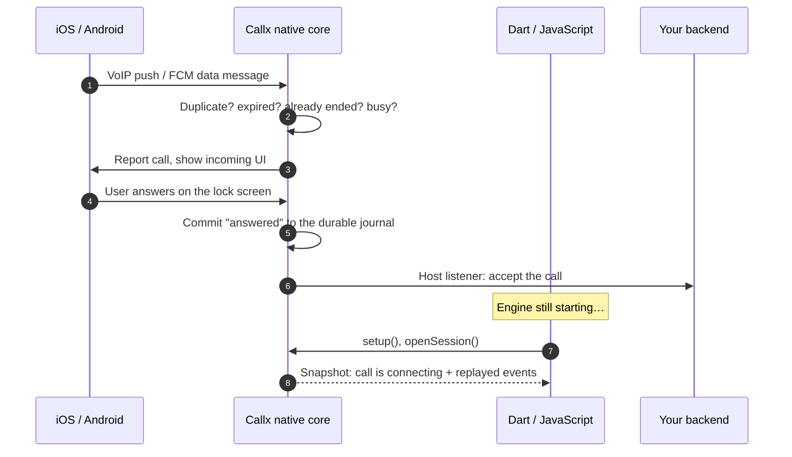

# Why Callx

Adding calls to a Flutter or React Native app looks like a UI problem. It is a timing problem.
The operating system acts on a call before your Dart or JavaScript code exists, and most call
libraries keep the call's state in exactly that code.

## The root cause

When a call arrives on a phone, a lot happens in a few seconds, often while the app is killed,
in the background or behind the lock screen:

1. A VoIP push (iOS) or a high-priority data message (Android) wakes the app's process.
2. iOS requires the app to report the call to CallKit **before the push handler returns**, or it
   terminates the app and may stop delivering VoIP pushes. Android requires the call to be
   added to Telecom and its notification shown within seconds.
3. The user answers or declines from the system UI, a watch or a car. That action must be
   recorded and sent to your backend.
4. Only then, maybe, the Flutter engine or the JavaScript bundle finishes loading.

If the call state lives in Dart or JavaScript, every step above races against engine startup.
That race is the source of the bugs that call integrations are known for:

| Symptom users report | What actually happened |
|---|---|
| Answered on the lock screen, but the app shows the call as still ringing | The answer arrived before JavaScript registered its listener |
| Declined while the app was killed, but the caller keeps ringing | No code was running to tell the backend |
| The app crashes on an incoming push in release builds | The CallKit report waited on the JavaScript bridge and the watchdog killed the process |
| A cancelled call rings again a minute later | A delayed push arrived after the cancel, and nothing remembered the call had ended |
| The notification stays after the caller hangs up | The end event arrived while the app was killed |

We read the 570 issues filed against `react-native-callkeep` and the issues of newer libraries
before designing Callx. Answer and end state getting out of sync (158 issues), killed and
background apps (141) and missing incoming UI (135) are the largest groups. Most of them share
this one cause.

## The Callx approach: native owns the call

Callx moves the call's state, and the code paths the OS waits on, into a native core: Swift on
iOS and Kotlin on Android. The same core runs under both frameworks.

- **The native core decides whether a call may ring.** Duplicates, expired invitations, a
  second call and calls that were already cancelled never ring, even when the cancel arrived
  before the invitation.
- **Every action is committed natively first.** An answer from the lock screen, a decline from
  a watch, a hang-up from a car: each is written to a durable journal before your UI hears of
  it.
- **Your UI attaches when it is ready.** Dart and JavaScript open an observation session and
  receive a consistent snapshot plus the events they missed. They never infer state.
- **Commands have results, not hopes.** Each command returns `applied`, `rejected`,
  `timedOut` or `unknown`, with an idempotent operation ID you can look up after a crash.

## Principles

**One owner for each call.** Only the Callx core reports calls to CallKit and Core-Telecom.
Adapters translate provider events into Callx calls; they never report to the OS themselves.
Two libraries reporting the same call is a classic source of ghost calls.

**Answered is not connected.** Answering moves a call to `connecting`. It becomes `active` only
when your media actually flows. Your UI can show "Connecting…" honestly.

**Honest about the platform.** Some things no library can do: deliver a push to a force-stopped
Android app, ring before the first unlock after a reboot, or keep an OEM battery manager from
killing a process. Callx documents these limits on the [platform pages](/platforms/android)
instead of hiding them.

**No phone-home.** The library sends nothing anywhere. There is no telemetry, not even opt-in.

**Small, stable surfaces.** One contract (`0.2.0` in version 0.2.2 packages), checked by executable fixtures on Swift,
Kotlin, Dart and TypeScript. Package versions move in lockstep.

## Build on the native foundation

That foundation now supports optional native media adapters, video surfaces, Android system
PiP and framework call UI. Your screens observe the same snapshots; installing an adapter or
using the call overlay does not transfer call ownership to Dart or TypeScript.
[Explore the features and real emulator captures](/guide/features), or
[check platform verification](/project/status) before choosing an integration.

## What Callx does not do

Callx is deliberately not a calling service:

- **No media server.** The core coordinates media through an adapter; the optional
  [LiveKit adapter](/guide/livekit) handles native audio/video. Your provider runs the media infrastructure.
- **No signaling server.** It does not create calls, choose who answered first or deliver
  events between users. Your backend does; [the backend guide](/guides/backend) gives a
  complete reference design.
- **No push sending.** Your backend holds the APNs and Firebase credentials and sends the
  invitations.
- **One live call at a time** in this version. Multi-call, conference merging and DTMF are on
  the [roadmap](/project/roadmap).

That boundary is what lets Callx work with any backend and any media provider, and it means
there is no Callx server between your users.

## Who Callx is for

- **Teams adding voice calls** to a consumer or business app: support lines, telehealth,
  marketplaces, dating, field services.
- **Teams already on a media SDK** (LiveKit, Agora, Twilio Video, Daily…) who need the phone
  side to behave like a real phone.
- **Teams migrating** from `react-native-callkeep`, `flutter_callkit_incoming` or hand-written
  CallKit code. See the [migration guides](/guides/migrate-callkeep).

If you need a turnkey service with numbers, PSTN and hosted signaling, a provider such as Twilio
Voice is a better fit, and Callx can still own the phone side in
[provider-managed mode](/guides/provider-managed). The [comparison page](/compare) covers the
alternatives in detail.
